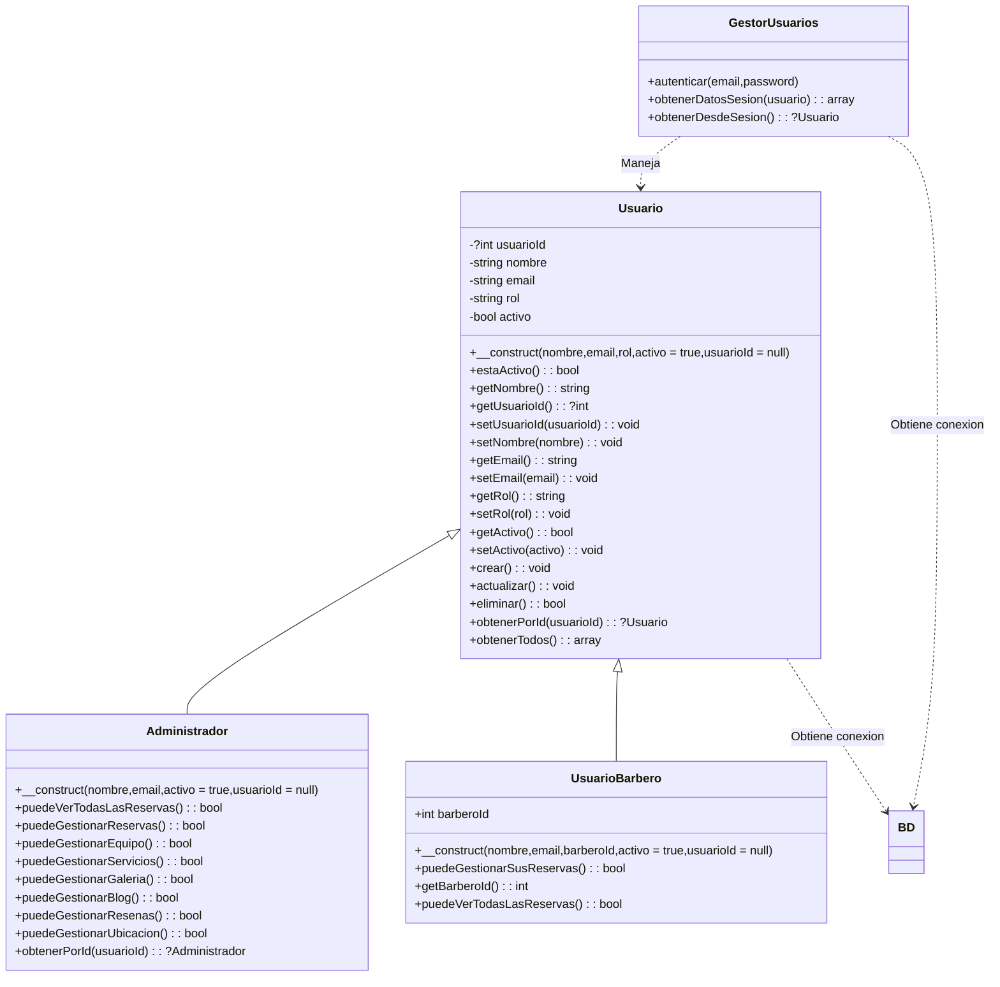

# Diagrama de Clases (Autogenerado)

```mermaid
classDiagram
    class Administrador {
        +__construct(nombre,email,activo = true,usuarioId = null)
        +puedeVerTodasLasReservas() : bool
        +puedeGestionarReservas() : bool
        +puedeGestionarEquipo() : bool
        +puedeGestionarServicios() : bool
        +puedeGestionarGaleria() : bool
        +puedeGestionarBlog() : bool
        +puedeGestionarResenas() : bool
        +puedeGestionarUbicacion() : bool
        +obtenerPorId(usuarioId) : ?Administrador
    }

    class GestorUsuarios {
        +autenticar(email,password)
        +obtenerDatosSesion(usuario) : array
        +obtenerDesdeSesion() : ?Usuario
    }

    class Usuario {
        -?int usuarioId
        -string nombre
        -string email
        -string rol
        -bool activo
        +__construct(nombre,email,rol,activo = true,usuarioId = null)
        +estaActivo() : bool
        +getNombre() : string
        +getUsuarioId() : ?int
        +setUsuarioId(usuarioId) : void
        +setNombre(nombre) : void
        +getEmail() : string
        +setEmail(email) : void
        +getRol() : string
        +setRol(rol) : void
        +getActivo() : bool
        +setActivo(activo) : void
        +crear() : void
        +actualizar() : void
        +eliminar() : bool
        +obtenerPorId(usuarioId) : ?Usuario
        +obtenerTodos() : array
    }

    class UsuarioBarbero {
        +int barberoId
        +__construct(nombre,email,barberoId,activo = true,usuarioId = null)
        +puedeGestionarSusReservas() : bool
        +getBarberoId() : int
        +puedeVerTodasLasReservas() : bool
    }

    Usuario <|-- Administrador
    Usuario <|-- UsuarioBarbero
    GestorUsuarios ..> Usuario : Maneja
    GestorUsuarios ..> BD : Obtiene conexion
    Usuario ..> BD : Obtiene conexion
```